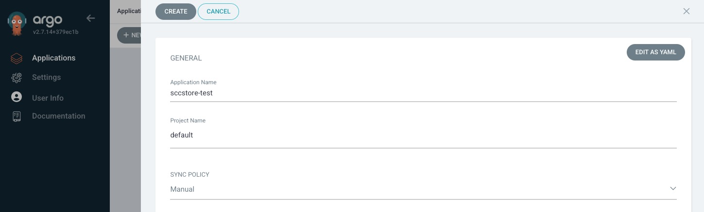

## Prepare the OpenShift cluster environment (part II - TEST)
Other than for DEV, in the TEST stage we will use ArgoCD for the deployment and not manually invoke Helm.
### Install ArgoCD
ArgoCD can be easily installed using the Operator Hub:

  

Once ArgoCD is operational, we have to give permission to the Argo CD service account to control the cluster:

    oc adm policy add-cluster-role-to-user cluster-admin -z openshift-gitops-argocd-application-controller -n openshift-gitops

Now we can log-in to ArgoCD using the OpenShift credentials, but before creating our SCCStore TEST application in ArgoCD, we need to push the Helm charts we use to a Helm repository.
Why that? Because ArgoCD relies on a Helm repository for obtaining the charts when using Helm for deployments. 

### Publish Helm charts to the Github Helm-Chart repository (optional)
> Why is this an optional task? Because as long as you do not plan to change the Helm charts, there is no need to re-package and publish the charts. They are already available in my SCCStore-Helm repository!

However, in case you choose to do so...

I am not going into the details of Halm usage, however, there is a `SCCStore-Helm` project in Github for this... you can create a fork as well. In `Sccstore-Helm` you can use:

    helm package ../SCCstore/sccstore-charts -d .
    helm repo index --url https://domenico-piol.github.io/SCCStore-Helm . --merge ./index.yaml

To package a new version of the helm-charts. Don't forget to update the Helm version-info's appropriately in `SCCStore`.

The new Helm-Chart version is published automatically by Github after the commit/push.

### Create ArgcoCD application for TEST
After login to ArgoCD using the OpenShift credentials, we can create an application named sccstore-test:

  

Use:
| Attribute | Value |
| ----------- | ----------- |
| Application Name: | sccstore-test |
| Project Name | default |
| Repository URL | https://domenico-piol.github.io/SCCStore-Helm/   *This is my helm-chart repository, if you choose to create your own, this need to change!*|
| Chart | sccstore-charts *(choose from list)* |
| Version | *just pick the last recent version from the list* |
| Cluster URL | https://kubernetes.default.svc *(pick from list)* |
| Namespace | sccstore-test |
| Values Files | values.yaml *(pick from list)* |

Leave the rest as it is!

> In a real world, we would link the execution of the sync to a trigger-event, such as merge to a certain branch.
However, for simplicity sake, we will trigger the sync manually!

During the sync operation you will notice all components starting and once every application component being ready (Postgres database, Spring Frontend and Quarkus backend), a Job is started which will initialize the database. After that, the application is fully operational.