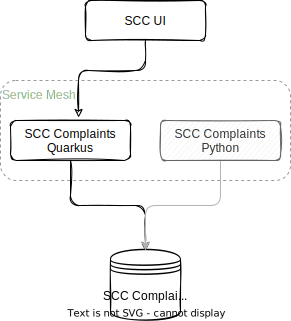

# The 'Sirius Cybernetics Corporation Online Store' demo application
SCCstore is a Spring Boot based, cloud native demo application using microservice design patterns.

In this project I'm demonstrating how to use Spring Boot for building microservice-based architecture for Kubernetes. This example is based on Spring Boot 2.5.

# Getting Started
This project is a multi-module Maven project based on Spring Boot 2.5.x, Quarkus, a PostgreSQL database and intended to be run on OpenShift.

## Architecture
This sample microservices-based system consists of the following modules (target state, not there yet!):

  

- **SCC UI** - the user-interface component of the application
- **SCC Complaints (quarkus)** - Java/Quarkus implementation of the complaints controller
- **SCC Complaints (python)** - Python implementation of the complaints controller
- **SCC Complaints Database** - the relational database for complaints

> The Service Mesh is not yet implemented and therefore the **SCC Complaints (python)** component is not yet deployed during the deployment.

## Usage Guide
For building the demo application you will need Maven 3.5 or newer (I am using v3.8.2), Java 17 and Quarkus and Tekton for the CI/CD pipeline. 

For running it, as said, you will need OpenShift, but it should perfectly work also on any other container platform. 

In the PROD setup, I use a PostgreSQL database which runs on a VM... In the DEV setup the database runs within a container.

### Prepare the OpenShift cluster environment (part I - DEV)
For this I use an OpenShift cluster on AWS. When choosing another cloud-provider or environment you will to change the storage-class in the helm values file for the database (for AWS I use 'gp3').

#### Step 1 - create the required namespaces
We need a namespace for running the pipelines, one for running the dev-stage and one for the prod-stage.

    oc new-project sccstore-pipelines
    oc new-project sccstore-dev
    oc new-project sccstore-prod

#### Step 2 - install Tekton, required Tasks and privileges
We use Tekton for building the application. First, install Tekton using the OperatorHub.

  

Once the Tekton Operator is running, we need some Tasks being installed. For that let's switch to the `sccstore-pipelines` namespace.

    oc project sccstore-pipelines
There we can install the required Tasks, from Tekton Hub:

    tkn hub install task git-clone
    tkn hub install task maven
    tkn hub install task buildah --version 0.5   ## later version is generating errors
And our own custom Tasks:

    oc apply -f cicd/dpiol-skopeo-copy.yaml
    oc apply -f cicd/build-info.yaml

Our pipeline also requires some storage, for building and the registry:

    oc apply -f cicd/build-storage.yaml

 The whole pipelines are running under the `pipelines` ServiceAccount. In OpenShift, this ServiceAccounts already exists, if not create it using:

    oc create serviceaccount pipeline

Now add the required privileges to that ServiceAccount to be able to build container-images:

    oc adm policy add-scc-to-user privileged -z pipeline
    oc adm policy add-role-to-user edit -z pipeline

Buildah requires credentials to the image registry we push the container-images to. Same is true for Skopeo. Buildah ist creating and pushing the images, Skopeo will add additional Tags to them.

We use docker.io in this example, unfortunately Buildah and Skopeo require the same credential in different formats (!!!). 

Buildah can use the credentials for docker.io in the config.json format. For this, we need to add the config.json containing the access token as a Secret. For encoding the `config.json` file upfront, use:

    cat config.json | base64
Then add the generated hash to the yaml-file below.

    apiVersion: v1
    kind: Secret
    metadata:
      name: rhworkshops-dockerconfig-secret
    data:
      config.json: ewoJImF1...

On the other hand, Skope expects the username and password 

    apiVersion: v1
    kind: Secret
    metadata:
      name: rhworkshops-dockerio-creds-username
      annotations:
        tekton.dev/docker-0: https://docker.io
    type: kubernetes.io/basic-auth
    stringData:
       username: USERNAME
       password: PASSWORD

Apply those 2 yaml files to the sccstore-pipelines namespace:

    oc apply -f rhworkshops-docker-io-secret.yaml 
    oc apply -f rhworkshops-docker-io-secret-usernamepassword.yaml 

As a next step, you need to link the generated secret containeg the username/password key-value pair to the service-account:

    oc secrets link pipeline rhworkshops-dockerio-creds-username 

That's it... the Tekton pipeline environment is now ready!

#### Step 3 - start our first build
Now that the build-pipeline environment is ready to be used, let's start our first build.
First, install the pipeline:

    oc apply -f cicd/tekton-pipeline.yaml

The pipeline is ready now, but it's not running yet. In a real world-scenario the run would be triggered by an git-repository event such as a commit, merge et al.
For sake of this exercise, we will trigger the build manually by providing a PipelineRun manifest.

    oc apply -f cicd/tekton-pipeline-run.yaml

  

The pipeline will build the complete project, create container-images for all components, tag the images with the build-hash, push them to docker.io and add also the `latest` tag.

#### Step 4 - install the serverless environment (KNative)
Now we install Red Hat OpenShift Serverless (KNative) from OperatorHub.

  

We can keep all the defaults.

Once installed we need to create a KnativeServing instance in the `knative-serving` namespace!

  

Once it's ready (see "status" labels), we are good to continue.

### Deploy to DEV stage
For DEV stage, we use simply Helm on the command line. But first we must switch to the DEV namespace!

    oc project sccstore-dev

    helm install sccstore sccstore-charts

This will pick the `latest` tag of all the images and deploy the complete application to OpenShift.

To delete the complete deployment, use:

    helm delete sccstore

  

You be seeing the `liquibase constraints` job failing initially until the PostgreSQL database is ready. That is absolutely to be expected. It will complete successfully after PostreSQL is ready.

Once every component has completed tha startup, you can access the application in the `sccstore-ui` component.

  

To access the data in the database, click on "Complaints Department" in the menu and click on Marvin, the depressed robot.

