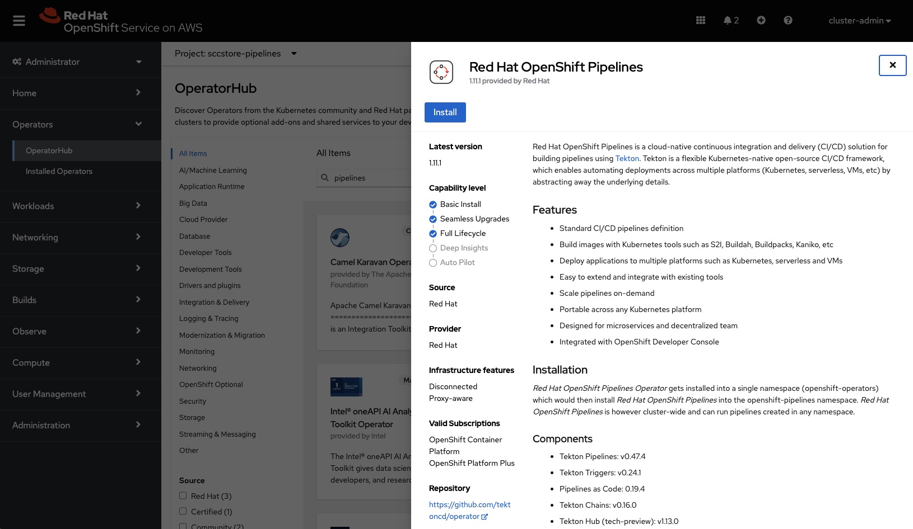

# The 'Sirius Cybernetics Corporation Online Store' demo application
SCCstore is a Spring Boot based, cloud native demo application using microservice design patterns.

In this project I'm demonstrating how to use Spring Boot for building microservice-based architecture for Kubernetes. This example is based on Spring Boot 2.5.

# Getting Started
This project is a multi-module Maven project based on Spring Boot 2.5.x, Quarkus, a PostgreSQL database and intended to be run on OpenShift.

## Architecture
This sample microservices-based system consists of the following modules (target state, not there yet!):

  

- **SCC UI** - the user-interface component of the application
- **SCC Complaints (quarkus)** - Java/Quarkus implementation of the complaints controller
- **SCC Complaints (python)** - Python implementation of the complaints controller (not used yet)
- **SCC Complaints Database** - the relational database for complaints

> **NOTE** The Service Mesh is not yet implemented and therefore the **SCC Complaints (python)** component is not yet deployed during the deployment.

On a deployment level, there is a big difference between DEV/TEST and PROD deployment. On DEV and TEST, the database is deployed within a container on OpenShift, whereas on PROD the database is running on a VM!

  

## Build and deployment process
For the build process we will use the capabilities of Tekton. A Tekton pipeline will build, package and push the images to our image-registry on docker.io.

  

Also, we will work with 3 different stages for this workshop. DEV, TEST and PROD. The difference being - beside the database running in a VM on PROD - that on DEV we use manual deployment whereas on TEST and PROD we will use ArgoCD for CI!

  

The VM containing the database will be set-up by Ansible during the deployment process. More details later...

This said, overall it looks like this:

  

# Usage Guide
For building the demo application you will need Maven 3.5 or newer (I am using v3.8.2), Java 17 and Quarkus and Tekton for the CI/CD pipeline. 

For running it, as said, you will need OpenShift, but it should perfectly work also on any other container platform. 

In the PROD setup, I use a PostgreSQL database which runs on a VM... In the DEV setup the database runs within a container.

## Local development using Podman
For local development and test we can use Podman and Podman-Compose. On Mac's you can use Homebrew to install `podman`, `podman-compose` and the `psql` commandline client.

    brew install podman
    brew install podman-compose
    brew install libpq

Start the Podman environment:
    
    podman machine start

In this example we will start the PostgreSQL database and the middleware component (pcomplaints) as pods on Podman, the SpringBoot UI then can be started for testing out of the IDE.

The `podman-compose` file is in the `compose` subdirectory!
    
    podman-compose --file sccstore-compose.yaml up -d

Now you can initialize the database:

    psql -h localhost -p 5432 -U postgres < sccstore-db-init.sql

The `pcomplaints` middle-tier is listening on `http:localhost:8080/complaints`, the SCCstore UI will connect by default to that IP.

## Prepare the OpenShift cluster environment (part I - DEV)
For this I use an OpenShift cluster on AWS. When choosing another cloud-provider or environment you will to change the storage-class in the kustomize template file for the database (for AWS I use 'gp3').

### Step 1 - create the required namespaces
We need a namespace for running the pipelines, one for running the dev/test-stage and prod-stage.

    oc new-project sccstore-pipelines
    oc new-project sccstore-dev
    oc new-project sccstore-test      # can be ignored for now
    oc new-project sccstore-prod

### Step 2 - install Tekton, required Tasks and privileges
We use Tekton for building the application. First, install Tekton using the OperatorHub.

  

Once the Tekton Operator is running, we need some Tasks being installed. For that let's switch to the `sccstore-pipelines` namespace.

    oc project sccstore-pipelines
There we can install the required Tasks, from Tekton Hub:

    tkn hub install task git-clone
    tkn hub install task maven
    tkn hub install task buildah
And our own custom Tasks:

    oc apply -f cicd/dpiol-skopeo-copy.yaml
    oc apply -f cicd/build-info.yaml

Our pipeline also requires some storage, for building and the registry:

    oc apply -f cicd/build-storage.yaml

 The whole pipelines are running under the `pipelines` ServiceAccount. In OpenShift, this ServiceAccounts already exists, if not create it using:

    oc create serviceaccount pipeline

Now add the required privileges to that ServiceAccount to be able to build container-images:

    oc adm policy add-scc-to-user privileged -z pipeline
    oc adm policy add-role-to-user edit -z pipeline

Buildah requires credentials to the image registry we push the container-images to. Same is true for Skopeo. Buildah ist creating and pushing the images, Skopeo will add additional Tags to them.

We use docker.io in this example, unfortunately Buildah and Skopeo require the same credential in different formats (!!!). 

Buildah can use the credentials for docker.io in the config.json format. For this, we need to add the config.json containing the access token as a Secret. For encoding the `config.json` file upfront, use:

    cat config.json | base64
Then add the generated hash to the yaml-file below.

In the `rhworkshops-docker-io-secret.yaml` file:

    apiVersion: v1
    kind: Secret
    metadata:
      name: rhworkshops-dockerconfig-secret
    data:
      config.json: ewoJImF1...

On the other hand, Skopeo expects the username and password, so in the `rhworkshops-docker-io-secret-usernamepassword.yaml` file:

    apiVersion: v1
    kind: Secret
    metadata:
      name: rhworkshops-dockerio-creds-username
      annotations:
        tekton.dev/docker-0: https://docker.io
    type: kubernetes.io/basic-auth
    stringData:
       username: USERNAME
       password: PASSWORD

Apply those 2 yaml files to the sccstore-pipelines namespace:

    oc apply -f rhworkshops-docker-io-secret.yaml 
    oc apply -f rhworkshops-docker-io-secret-usernamepassword.yaml 

> **NOTE** Be aware, this 2 files are the only ones NOT provided within this repository for obvious reasons. You must create them on your own!

As a next step, you need to link the generated secret containeg the username/password key-value pair to the service-account:

    oc secrets link pipeline rhworkshops-dockerio-creds-username 

That's it... the Tekton pipeline environment is now ready!

### Step 3 - start our first build
Now that the build-pipeline environment is ready to be used, let's start our first build.
First, install the pipeline:

    oc apply -f cicd/tekton-pipeline.yaml

The pipeline is ready now, but it's not running yet. In a real world-scenario the run would be triggered by an git-repository event such as a commit, merge et al.
For sake of this exercise, we will trigger the build manually by providing a PipelineRun manifest.

    oc apply -f cicd/tekton-pipeline-run.yaml

  

The pipeline will build the complete project, create container-images for all components, tag the images with the build-hash, push them to docker.io and add also the `latest` tag.

### Step 4 - install the serverless environment (KNative)
Now we install Red Hat OpenShift Serverless (KNative) from OperatorHub.

  

We can keep all the defaults.

Once installed we need to create a KnativeServing instance in the `knative-serving` namespace!

  

Once it's ready (see "status" labels), we are good to continue.

### Step 5 - install OpenShift Virtualization
Again, go to the Operator Hub and install OpenShift Virtualization.

For this step to succeed, be sure you have a default storage class configured!

## Deploy to DEV stage
With kustomize it's very easy to deploy the complete application - including the database in a container - to kubernetes. I am using OpenShift and therefore the `oc` command. However, `kubctl` works the same! 
And don't forget to switch to the `sccstore-dev` namespace before!

    oc apply -k kustomize/overlays/dev

If you want to delete everything again, use:

    oc delete -k kustomize/overlays/dev

  

You'll be seeing the `liquibase constraints` job failing initially until the PostgreSQL database is ready. That is absolutely to be expected. It will complete successfully after PostreSQL is ready.

Once every component has completed tha startup, you can access the application in the `sccstore-ui` component.

  

To access the data in the database, click on "Complaints Department" in the menu and click on Marvin, the depressed robot.

### Run the liquibase-job standalone
In dev stage there is no persistance. In case you need to re-run the liquibase only for initializing the database, you can run:

    oc apply -f kustomize/overlays/dev/db-liquibase-job.yaml 

## Deploy to PROD stage
PROD stage is different... you know somebody who is running production databases in containers? I don't... So, this said, our database in PROD will be running in a VM using kubevirt (OpenShift Virtualization in my case).

In a first step, we need to create the VM manually, I will try to automate this later using Ansible.

### Prepare the database VM
1. **Create a Fedora VM**
Do this in the sccstore namespace and add the fedora SSH Public Key (mine is stored in from ~/.ssh/) in the "Scripts" section during creation in Openshift Virtualization UI!!! Or add the pubkey manually using:
`oc create secret generic fedora-key --from-file=fedora.pub=/Users/domenico/.ssh/fedora.pub`

Name the VM "pg-database" or you need to change the service-file..

1. **Install Ansible**
Login to the VM using `virtctl ssh -i ~/.ssh/fedora fedora@pg-database`
And then install Ansible `sudo dnf install ansible`

1. **Create and configure the DB**
Login and copy the Ansible script to the VM and run it:
`virtctl ssh -i ~/.ssh/fedora fedora@pg-database`
Then paste the db-vm-ansible.yaml to a the VM into pg.yaml and run it as root! (password required for sudo - get the user-password from console in OCP)
`sudo ansible-playbook pg.yaml -K`

### Deploy the application without database
Once the database is created, you can again deploy the application like in the DEV stage... be sure to be i the correct namespace!

    `oc apply -k kustomize/overlays/prod`

Looking to the output, you will notice that the db-creation objects are not being deployed, that happens only DEV.
And looking at the db-service, you will notice a difference compared to DEV. The service points to the VM. That's it... no further change to the application required.

Again, you can delete everything (except the database VM) by using:

    `oc delete -k kustomize/overlays/prod`
